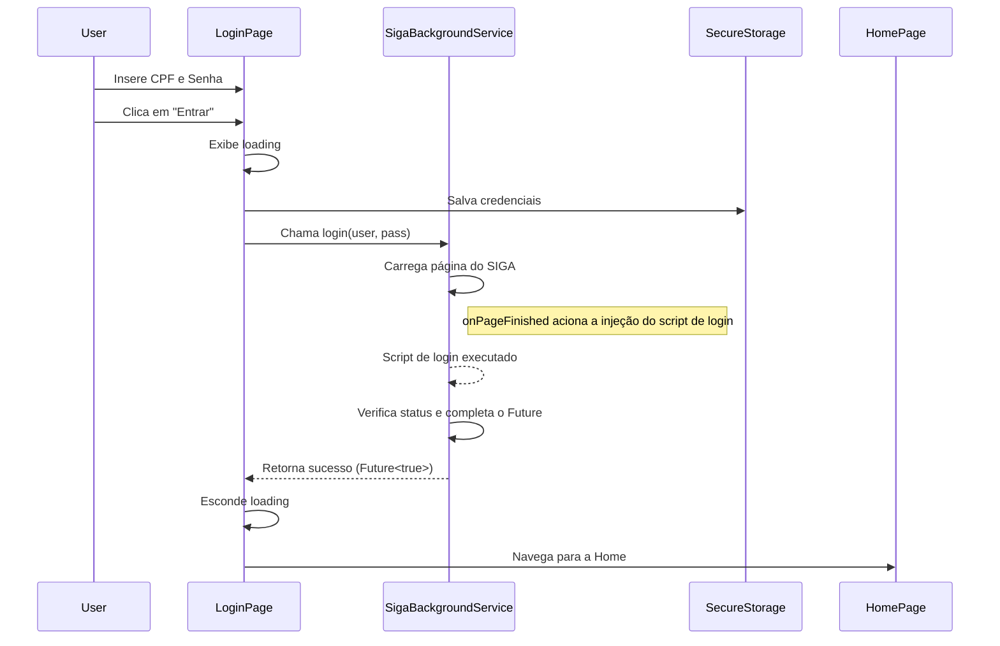
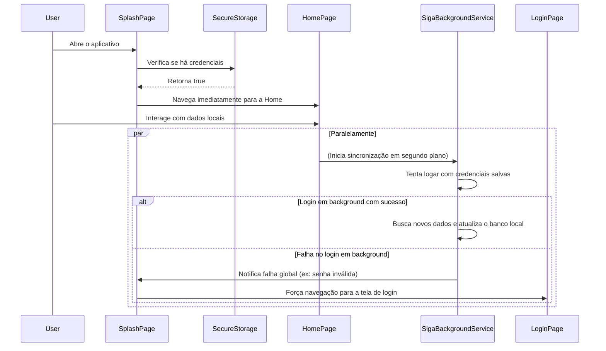

# Documento de Design da Modificação: Melhoria do Fluxo de Login (Híbrido)

## 1. Visão Geral

Este documento descreve o design para a melhoria do fluxo de login no aplicativo My UFAPE, adotando uma **abordagem híbrida (offline-first)**. O objetivo é duplo:

1.  **Resolver o problema do login inicial**: Garantir que um login ativo, via `LoginPage`, aguarde a confirmação do `SigaBackgroundService` antes de navegar para a `HomePage`.
2.  **Garantir funcionamento offline**: Permitir que o usuário acesse o aplicativo e seus dados já salvos localmente, mesmo sem conexão com a internet, em inicializações subsequentes.

## 2. Análise Detalhada do Problema

O fluxo de login original apresentava dois problemas principais:

1.  **Navegação Prematura**: Tanto na `LoginPage` quanto na `SplashPage`, a navegação para a `HomePage` ocorria antes da confirmação do login com o serviço do SIGA, causando inconsistências de estado.
2.  **Dependência Online**: A primeira versão da solução exigia uma verificação online a cada inicialização, o que impedia o uso offline do aplicativo.

## 3. Design Detalhado da Modificação

A nova arquitetura equilibra a necessidade de verificação online com a de acesso offline.

### 3.1. `SplashViewModel`: Acesso Imediato (Offline-First)

O `SplashViewModel` será o ponto de entrada para o acesso offline.

- **Lógica do método `init()`**:
  1.  Verifica no `FlutterSecureStorage` se existem credenciais salvas.
  2.  **Se não houver credenciais**: Navega para `routePaths.login`.
  3.  **Se houver credenciais**: Navega **imediatamente** para `routePaths.home`. Isso dá ao usuário acesso instantâneo aos dados locais (Isar).
  4.  Após a navegação para a Home, o `SigaBackgroundService` (que é um singleton inicializado em outro ponto) continuará seu ciclo de vida normal: tentará logar em segundo plano e sincronizar os dados se houver conexão.

```dart
// Lógica conceitual para SplashViewModel.init()
init() async {
  final hasCredentials = await settingsRepository.hasUserCredentials(); // Um novo método no repositório

  // Pequeno delay para a splash ser visível
  await Future.delayed(const Duration(milliseconds: 1200));

  if (hasCredentials) {
    // Vai direto para a Home, permitindo acesso offline aos dados locais.
    // O SigaBackgroundService fará a sincronização em segundo plano por conta própria.
    Routefly.navigate(routePaths.home);
  } else {
    // Sem credenciais, precisa fazer o login inicial.
    Routefly.navigate(routePaths.login);
  }
}
```

### 3.2. `LoginPage`: Login Ativo e Online

A `LoginPage` será responsável pelo login ativo, que **exige conexão com a internet** e confirmação do serviço.

- **Gerenciamento de Estado de Carregamento**: A UI indicará o estado de "carregando" (`_isLoading`) enquanto o login estiver em andamento.

- **Lógica do método `_handleLogin()`**:
  1.  Valida o formulário.
  2.  Ativa o estado `_isLoading` (exibindo um `CircularProgressIndicator`).
  3.  Salva as credenciais no `FlutterSecureStorage`.
  4.  Chama um método `login()` no `SigaBackgroundService`, passando as credenciais.
  5.  **Aguarda** o `Future<bool>` retornado pelo método `login()`.
  6.  Se `true` (sucesso), desativa o `_isLoading` e navega para a `HomePage`.
  7.  Se `false` (falha), desativa o `_isLoading` e exibe uma `SnackBar` com uma mensagem de erro.

### 3.3. `SigaBackgroundService`: Orquestração e Notificação de Falhas

O serviço será aprimorado para lidar com o login ativo e notificar a aplicação sobre falhas críticas.

- **Novo `Completer` para Login Ativo**: Um `Completer<bool>? _loginCompleter;` será usado para sinalizar a conclusão de um login ativo iniciado pela `LoginPage`.

- **Novo método `login(username, password)`**:
  ```dart
  Future<bool> login(String username, String password) async {
    _loginCompleter = Completer<bool>();

    // Guarda as credenciais para o processo de login
    _pendingUsername = username;
    _pendingPassword = password;

    // Força o recarregamento da página de login
    await _controller?.loadRequest(
      Uri.parse('https://siga.ufape.edu.br/ufape/index.jsp'),
    );

    // Aguarda o completer ser finalizado pelo onPageFinished/checkLoginStatus
    return _loginCompleter!.future.timeout(const Duration(seconds: 30), onTimeout: () => false);
  }
  ```

- **Lógica no `onPageFinished` e `_checkLoginStatus`**:
  - Quando o login for confirmado (`_isLoggedIn` se torna `true`), se `_loginCompleter` não for nulo, ele será completado com `true` (`_loginCompleter!.complete(true)`).
  - Se um erro definitivo de login for detectado (ex: mensagem de "usuário ou senha inválida" na página), o `_loginCompleter` será completado com `false`.

- **Notificação Global de Falha de Autenticação**:
  - Se, durante a sincronização em segundo plano, o serviço detectar que as credenciais salvas são inválidas, ele precisa forçar o usuário a fazer login novamente.
  - Isso pode ser feito através de um `Stream` ou `ValueNotifier` global que a `AppWidget` ou um widget pai escuta. Ao receber a notificação, ele usaria o `Routefly` para navegar à força para a tela de login.

### 3.4. Diagrama de Sequência (Mermaid)

#### Fluxo 1: Login Ativo (Online)



#### Fluxo 2: Inicialização do App (Offline)



## 4. Resumo do Design

A nova abordagem híbrida oferece o melhor de dois mundos: a agilidade e a conveniência do acesso offline, permitindo que o usuário veja seus dados imediatamente ao abrir o app, e a robustez de um login online verificado quando o usuário precisa se autenticar ativamente. A sincronização em segundo plano mantém os dados atualizados de forma transparente, e um mecanismo de falha global garante que credenciais inválidas sejam tratadas adequadamente, forçando uma nova autenticação quando necessário.