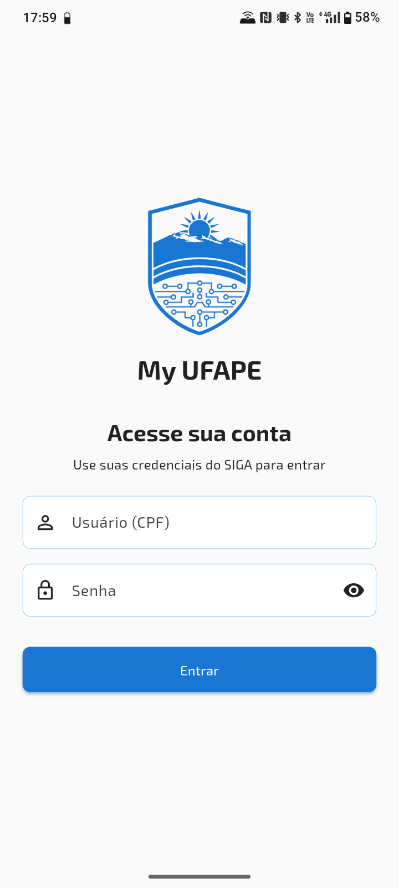
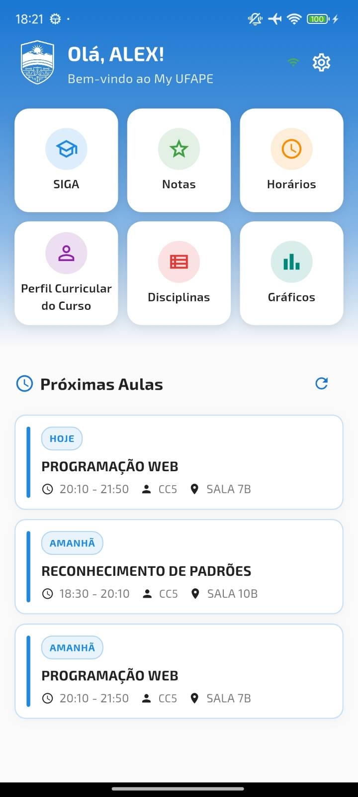
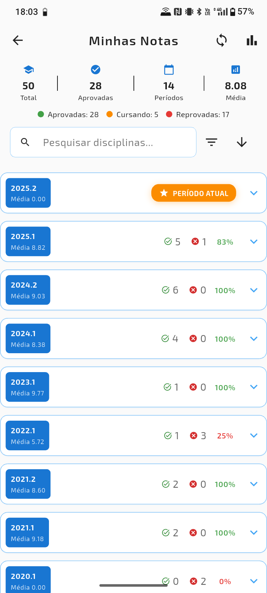
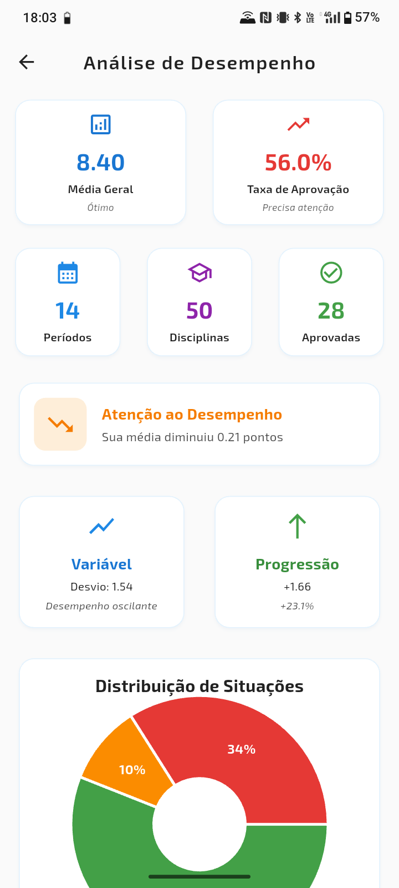
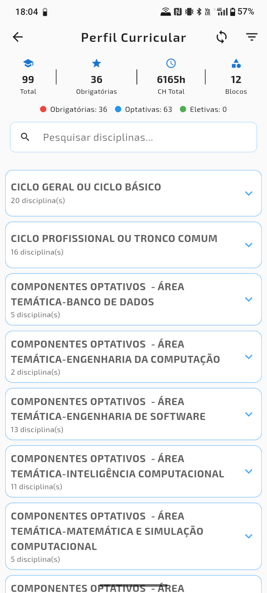
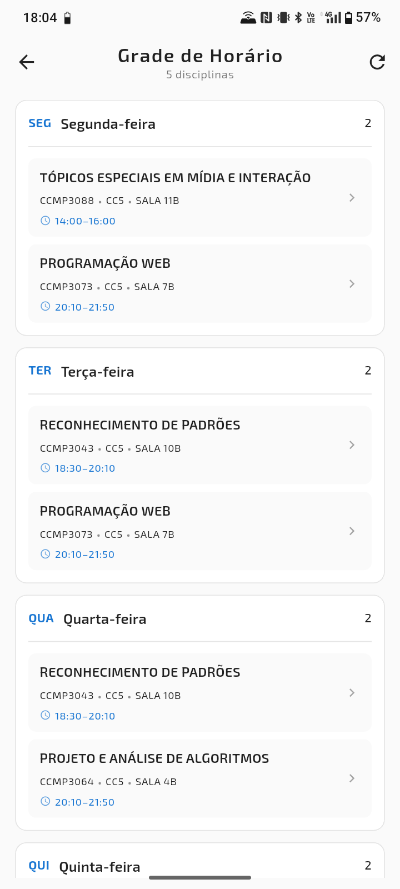

# My UFAPE - Aplicación Móvil para Estudiantes de la UFAPE


**My UFAPE** es una aplicación no oficial, construida con Flutter, diseñada para ofrecer a los estudiantes de la Universidad Federal del Agreste de Pernambuco (UFAPE) una experiencia móvil moderna y eficiente para acceder a su información académica.

La aplicación se integra con el portal SIGA (Sistema Integrado de Gestión de Actividades Académicas), extrayendo datos de forma segura y presentándolos en una interfaz nativa, rápida e intuitiva, con funcionalidades offline.

[](https://flutter.dev)
[](https://opensource.org/licenses/MIT)
[](https://flutter.dev)

---

## 👨‍💻 Autor

Desarrollado por **Alex Silva**.

- **GitHub:** [alexlsilva7](https://github.com/alexlsilva7)
- **Repositorio del Proyecto:** [my_ufape](https://github.com/alexlsilva7/my_ufape)

---

## ✨ Funcionalidades Principales

- **🎓 Historial de Calificaciones Detallado:** Sigue tu desempeño académico con todas las calificaciones, ausencias y situación en cada asignatura, agrupadas por periodo.
- **📅 Horario de Clases:** Visualiza tu horario semanal de forma clara y organizada.
- **📚 Asignaturas:** Explora la estructura de tu carrera, ve todas las asignaturas (obligatorias, optativas, electivas), sus prerequisitos, programas y carga horaria.
- **📈 Análisis de Rendimiento:** Gráficos interactivos para visualizar tu evolución, promedio general, tasa de aprobación, distribución de calificaciones y mucho más.
- **🚀 Acceso Offline:** Después de la primera sincronización, todos tus datos académicos estarán disponibles offline, para acceder en cualquier momento.
- **🔄 Sincronización con SIGA:** Mantén tus datos actualizados con una sincronización segura y en segundo plano directamente desde el portal SIGA.
- **🎨 Tema Claro y Oscuro:** Elige el tema que más te guste.
- **🔒 Almacenamiento seguro:** Credenciales cifradas en el dispositivo mediante infraestructura nativa (iOS Keychain y Android Keystore).
---

## 📸 Capturas de Pantalla

| Inicio de Sesión                           | Inicio                               | Calificaciones                          |
| ------------------------------------------ | ------------------------------------ | --------------------------------------- |
|  |  |  |
| **Gráficos**                                 | **Perfil Curricular**                | **Horario de Clases**                   |
|  |  |  |

---

## 🏛️ Arquitectura y Tech Stack

Este proyecto fue construido con enfoque en escalabilidad, mantenibilidad y buenas prácticas de desarrollo, siguiendo una adaptación de los principios de **Clean Architecture** con el patrón **MVVM (Model-View-ViewModel)**.

- **Arquitectura:**
  - **Capa de Dominio (`lib/domain`):** Contiene las `Entities`, que son los modelos de datos puros del negocio (anotados para la base de datos Isar).
  - **Capa de Datos (`lib/data`):** Responsable de toda la lógica de acceso a datos.
    - **Repositories:** Contiene tanto las interfaces (contratos) como las implementaciones, agrupadas por feature.
    - **Services:** Lógica de bajo nivel que interactúa directamente con las fuentes de datos (Isar, SIGA, SharedPreferences).
  - **Capa de UI (`lib/ui`):** La capa de presentación, organizada por features (pantallas). Cada feature contiene su `View` (la página) y, cuando sea necesario, su `ViewModel` para la lógica de estado.

- **Principales Tecnologías y Paquetes:**
  - **Framework:** [Flutter](https://flutter.dev/)
  - **Base de Datos Local:** [Isar Community](https://pub.dev/packages/isar_community) (Rápida, NoSQL y optimizada para Flutter)
  - **Inyección de Dependencias:** [auto_injector](https://pub.dev/packages/auto_injector)
  - **Gestión de Rutas:** [routefly](https://pub.dev/packages/routefly)
  - **Actualizaciones Over-the-Air (OTA):** [Shorebird](https://shorebird.dev/)
  - **Manejo de Errores:** [result_dart](https://pub.dev/packages/result_dart)
  - **Web Scraping (SIGA):** [webview_flutter](https://pub.dev/packages/webview_flutter)
  - **Visualización de Gráficos:** [fl_chart](https://pub.dev/packages/fl_chart)
  - **Almacenamiento Seguro:** [flutter_secure_storage](https://pub.dev/packages/flutter_secure_storage)

---

## 🚀 Cómo Ejecutar el Proyecto

Siga los pasos a continuación para configurar y ejecutar el proyecto localmente.

### Prerrequisitos

- [Flutter SDK](https://docs.flutter.dev/get-started/install) (versión 3.35.5 o superior)

### Pasos para la Configuración

1.  **Clona el repositorio:**
    ```bash
    git clone https://github.com/seu-usuario/my_ufape.git
    cd my_ufape
    ```

2.  **Instala las dependencias:**
    ```bash
    flutter pub get
    ```

3.  **Genera los archivos de código (Isar y Routefly):**
    Este paso es crucial y debe ejecutarse siempre que alteres modelos de datos o la estructura de carpetas de las páginas.
    ```bash
    dart run build_runner build --delete-conflicting-outputs
    dart run routefly
    ```

4.  **Ejecuta la aplicación en modo de desarrollo:**
    ```bash
    flutter run
    ```
---

## 📁 Estructura del Proyecto

La estructura de carpetas del proyecto sigue los principios de Clean Architecture:

```
lib/
├── config/
│   └── dependencies.dart # Configuración de la Inyección de Dependencias
├── core/
│   ├── database/         # Configuración e inicialización de Isar
│   ├── exceptions/       # Excepciones personalizadas de la aplicación
│   └── ui/               # Configuraciones de UI (temas, assets, etc.)
├── data/
│   ├── parsers/          # Lógica de análisis de HTML para el web scraping
│   ├── repositories/     # Contratos e implementaciones de los repositorios, por feature
│   └── services/         # Comunicación con fuentes de datos (Isar, SIGA)
├── domain/
│   └── entities/         # Modelos de datos puros del negocio (schema de Isar)
└── ui/
  ├── home/               # Ejemplo de una feature de UI (View + ViewModel)
  │   ├── home_page.dart
  │   └── home_view_model.dart
  ├── ...                 # Otras features (login, grades, settings, etc.)
  └── widgets/            # Widgets reutilizables en toda la aplicación

```

---

## 🚧 To-Do / Próximas Funcionalidades

- [ ] Acceso seguro mediante biometría (huella digital, reconocimiento facial).
- [ ] Implementar autenticación con CAPTCHA (resuelto mediante WebView).
- [ ] Notificaciones sobre próximas clases.
- [ ] Implementar más análisis y gráficos de rendimiento.
- [ ] Pruebas unitarias y de widgets.
- [ ] Optimizaciones de rendimiento en el web scraping.

---

## 🤝 Contribuciones

¡Las contribuciones son bienvenidas! Si tienes ideas, sugerencias o encuentras errores, no dudes en abrir una **Issue** o enviar un **Pull Request**.
