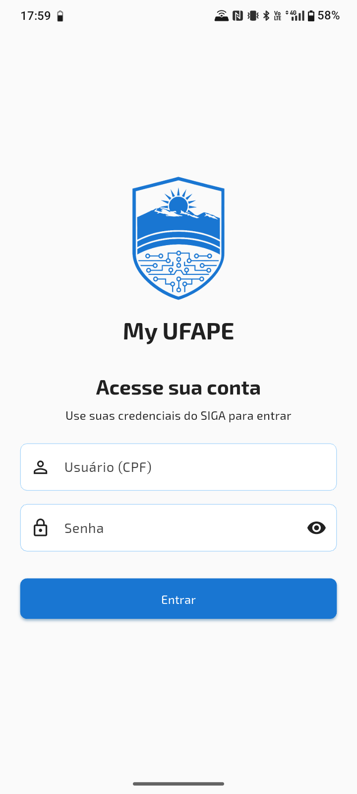
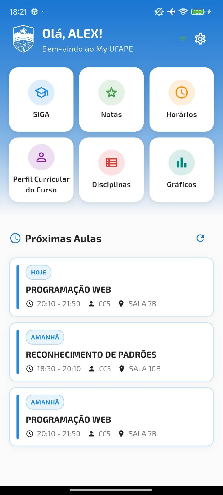
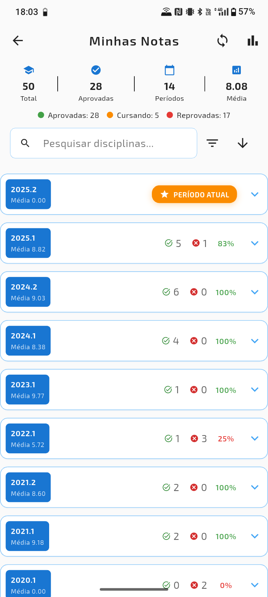
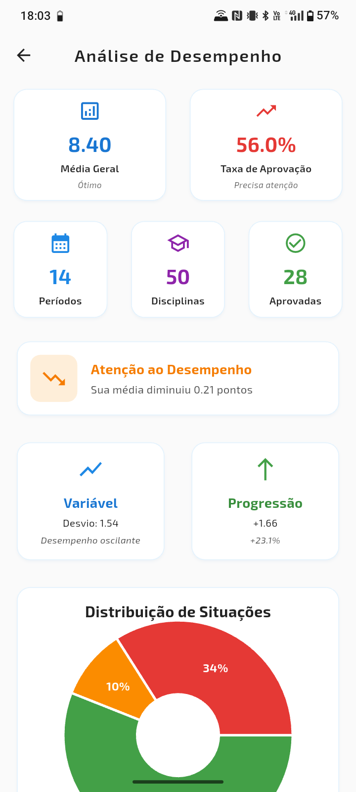
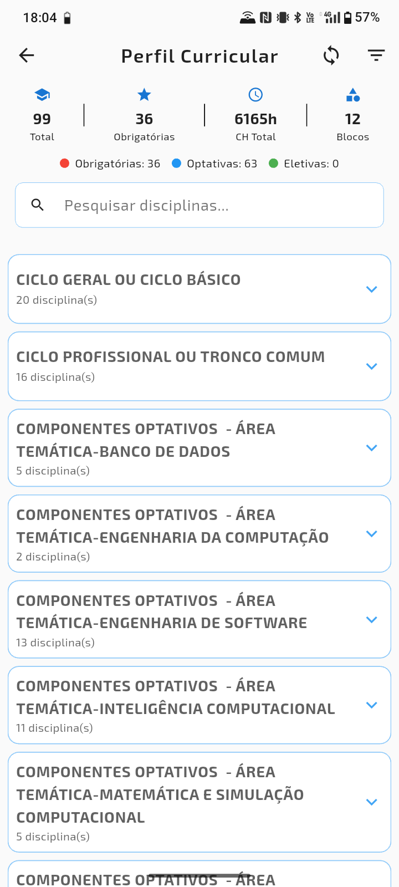

# My UFAPE - Aplicativo Móvel para Estudantes da UFAPE


**My UFAPE** é um aplicativo não oficial, construído com Flutter, projetado para oferecer aos estudantes da Universidade Federal do Agreste de Pernambuco (UFAPE) uma experiência móvel moderna e eficiente para acessar suas informações acadêmicas.

O aplicativo se integra ao portal SIGA (Sistema Integrado de Gestão de Atividades Acadêmicas), extraindo dados de forma segura e apresentando-os em uma interface nativa, rápida e intuitiva, com funcionalidades offline.

[](https://flutter.dev)
[](https://opensource.org/licenses/MIT)
[](https://flutter.dev)

---

## ✨ Funcionalidades Principais

- **🎓 Histórico de Notas Detalhado:** Acompanhe seu desempenho acadêmico com todas as notas, faltas e situação em cada disciplina, agrupadas por período.
- **📅 Grade de Horário:** Visualize sua grade de horários semanal de forma clara e organizada.
- **📚 Disciplinas:** Explore a estrutura do seu curso, veja todas as disciplinas (obrigatórias, optativas, eletivas), seus pré-requisitos, ementas e carga horária.
- **📈 Análise de Desempenho:** Gráficos interativos para visualizar sua evolução, média geral, taxa de aprovação, distribuição de notas e muito mais.
- **🚀 Acesso Offline:** Após a primeira sincronização, todos os seus dados acadêmicos ficam disponíveis offline, para acesso a qualquer momento.
- **🔄 Sincronização com o SIGA:** Mantenha seus dados atualizados com uma sincronização segura e em segundo plano diretamente do portal SIGA.
- **🎨 Tema Claro e Escuro:** Escolha o tema que mais lhe agrada.
- **🔒 Armazenamento seguro:** Credenciais cifradas no dispositivo via infraestrutura nativa (iOS Keychain e Android Keystore).
---

## 📸 Screenshots

| Login                                    | Home                                 | Notas                                 |
| ---------------------------------------- | ------------------------------------ | ------------------------------------- |
|  |  |  |
| **Gráficos**                               | **Perfil Curricular**                | **Grade Horária**                     |
|  |  |  |

---

## 🏛️ Arquitetura e Tech Stack

Este projeto foi construído com foco em escalabilidade, manutenibilidade e boas práticas de desenvolvimento, seguindo uma adaptação dos princípios da **Clean Architecture** com o padrão **MVVM (Model-View-ViewModel)**.

- **Arquitetura:**
  - **Camada de Domínio (`lib/domain`):** Contém as `Entities`, que são os modelos de dados puros do negócio (anotados para o banco de dados Isar).
  - **Camada de Dados (`lib/data`):** Responsável por toda a lógica de acesso a dados.
    - **Repositories:** Contém tanto as interfaces (contratos) quanto as implementações, agrupados por feature.
    - **Services:** Lógica de baixo nível que interage diretamente com as fontes de dados (Isar, SIGA, SharedPreferences).
  - **Camada de UI (`lib/ui`):** A camada de apresentação, organizada por features (telas). Cada feature contém sua `View` (a página) e, quando necessário, seu `ViewModel` para a lógica de estado.

- **Principais Tecnologias e Pacotes:**
  - **Framework:** [Flutter](https://flutter.dev/)
  - **Banco de Dados Local:** [Isar Community](https://pub.dev/packages/isar_community) (Rápido, NoSQL e otimizado para Flutter)
  - **Injeção de Dependência:** [auto_injector](https://pub.dev/packages/auto_injector)
  - **Gerenciamento de Rotas:** [routefly](https://pub.dev/packages/routefly)
  - **Atualizações Over-the-Air (OTA):** [Shorebird](https://shorebird.dev/)
  - **Tratamento de Erros:** [result_dart](https://pub.dev/packages/result_dart)
  - **Web Scraping (SIGA):** [webview_flutter](https://pub.dev/packages/webview_flutter)
  - **Visualização de Gráficos:** [fl_chart](https://pub.dev/packages/fl_chart)
  - **Armazenamento Seguro:** [flutter_secure_storage](https://pub.dev/packages/flutter_secure_storage)

---

## 🚀 Como Executar o Projeto

Siga os passos abaixo para configurar e rodar o projeto localmente.

### Pré-requisitos

- [Flutter SDK](https://docs.flutter.dev/get-started/install) (versão 3.35.5 ou superior)

### Passos para Configuração

1.  **Clone o repositório:**
    ```bash
    git clone https://github.com/seu-usuario/my_ufape.git
    cd my_ufape
    ```

2.  **Instale as dependências:**
    ```bash
    flutter pub get
    ```

3.  **Gere os arquivos de código (Isar e Routefly):**
    Este passo é crucial e deve ser executado sempre que você alterar modelos de dados ou a estrutura de pastas das páginas.
    ```bash
    dart run build_runner build --delete-conflicting-outputs
    dart run routefly
    ```

4.  **Execute o aplicativo em modo de desenvolvimento:**
    ```bash
    flutter run
    ```
---

## 📁 Estrutura do Projeto

A estrutura de pastas do projeto segue os princípios da Clean Architecture:

```
lib/
├── config/
│   └── dependencies.dart # Configuração da Injeção de Dependência
├── core/
│   ├── database/         # Configuração e inicialização do Isar
│   ├── exceptions/       # Exceções customizadas da aplicação
│   └── ui/               # Configurações de UI (temas, assets, etc.)
├── data/
│   ├── parsers/          # Lógica de parsing de HTML para o web scraping
│   ├── repositories/     # Contratos e implementações dos repositórios, por feature
│   └── services/         # Comunicação com fontes de dados (Isar, SIGA)
├── domain/
│   └── entities/         # Modelos de dados puros do negócio (schema do Isar)
└── ui/
  ├── home/               # Exemplo de uma feature de UI (View + ViewModel)
  │   ├── home_page.dart
  │   └── home_view_model.dart
  ├── ...                 # Outras features (login, grades, settings, etc.)
  └── widgets/            # Widgets reutilizáveis em toda a aplicação

```

---

## 🚧 To-Do / Próximas Funcionalidades

- [ ] Acesso seguro via biometria (impressão digital, reconhecimento facial).
- [ ] Implementar autenticação com CAPTCHA (resolvido via WebView).
- [ ] Notificações sobre próximas aulas.
- [ ] Implementar mais análises e gráficos de desempenho.
- [ ] Testes unitários e de widget.
- [ ] Otimizações de performance no web scraping.

---

## 🤝 Contribuições

Contribuições são bem-vindas! Se você tiver ideias, sugestões ou encontrar bugs, sinta-se à vontade para abrir uma **Issue** ou enviar um **Pull Request**.